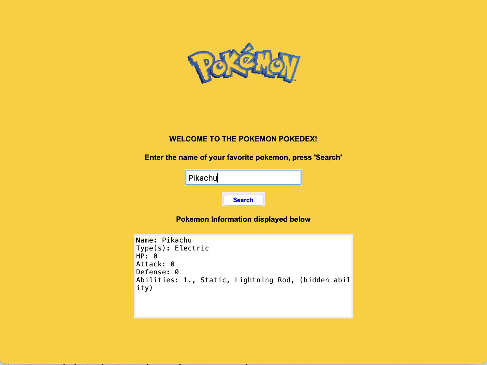

# FinalIntroPythonProject

Pokemon Pokedex

Final Project (Due on Friday of week 17 for everyone) 
Intro & Objectives

In this project you will put together concepts you have learned this semester. In the suggested project (see below) you will build a tool capable of searching the web and storing information in a database created and maintained by your program:

You must use:

    The WWW API to search the web
    Tkinter to build a GUI (alternatively you can use Django to build a website)
    sqlite3 to build the database
    
